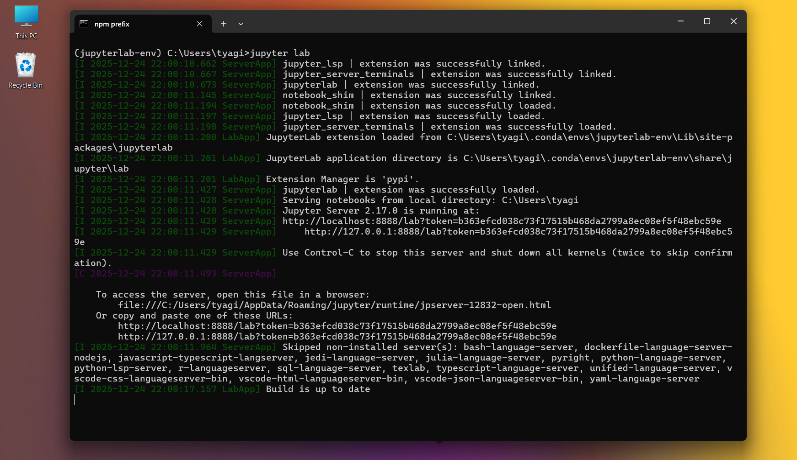

### 🧠 What is JupyterLab?

**JupyterLab** is a **modern, web-based interactive development environment (IDE)** for data science, AI, and machine learning.

It is the **next-generation interface of Jupyter Notebook**, designed to support **complete AI/ML workflows** in one place.

Think of it as:

> **Jupyter Notebook + Code editor + Terminal + File manager + Visualization tools**

—all inside a single browser tab.


### JupyterLab is called the *advanced version* of Jupyter Notebook!

Because it **extends and improves everything** the classic notebook can do.


#### 1️⃣ Multiple files in one workspace

In Jupyter Notebook:

* You open **one notebook at a time**

In JupyterLab:

* Open **multiple notebooks, Python files, CSVs, terminals**
* Arrange them **side by side (tabs / split view)**

👉 This is extremely useful in AI/ML projects.


#### 2️⃣ Built-in file browser

JupyterLab has a **left-side file explorer**:

* Browse datasets
* Open `.ipynb`, `.py`, `.csv`, `.json`
* Drag & drop files

No need to switch windows.


#### 3️⃣ Integrated terminal

You get a **Linux-like terminal** inside JupyterLab:

* Install libraries (`pip`, `conda`)
* Run scripts
* Manage environments

Classic Notebook **does not** include this.


#### 4️⃣ Better code editor (IDE-like features)

JupyterLab supports:

* Syntax highlighting
* Code completion
* Linting
* Multiple cursors

It feels closer to **VS Code**, but still notebook-friendly.


#### 5️⃣ Advanced visualization support

Graphs, plots, and dashboards:

* Resize dynamically
* View alongside code
* Compare results easily

Perfect for ML experiments.


#### 6️⃣ Designed for large AI/ML projects

JupyterLab scales better when:

* Working with multiple datasets
* Training models
* Tracking experiments
* Writing reusable ML code


### Jupyter Notebook vs JupyterLab (Quick Comparison)

| Feature              | Jupyter Notebook | JupyterLab      |
| -------------------- | ---------------- | --------------- |
| Single notebook view | ✅                | ❌               |
| Multi-tab workspace  | ❌                | ✅               |
| File browser         | ❌                | ✅               |
| Terminal             | ❌                | ✅               |
| IDE-like experience  | ❌                | ✅               |
| Best for             | Beginners        | AIML / Projects |


## How to install JupyterLab


### Install using conda

```bash
conda install  jupyterlab
```

## 📸 Screenshot Example: 


Then run:

```bash
jupyter lab
```

## 📸 Screenshot Example: 


### How JupyterLab opens

After running `jupyter lab`, it opens automatically in your browser at:

```
http://localhost:8888/lab
```
## 📸 Screenshot Example: 


### When should YOU use JupyterLab?

Use **JupyterLab** if you:

* Are learning **AI / Machine Learning / Data Science**
* Work with datasets & models
* Want a professional workflow
* Plan to do real-world ML projects


### In simple words

👉 **JupyterLab is called the advanced version of Jupyter Notebook because it provides a full AI/ML workspace instead of a single notebook.**

